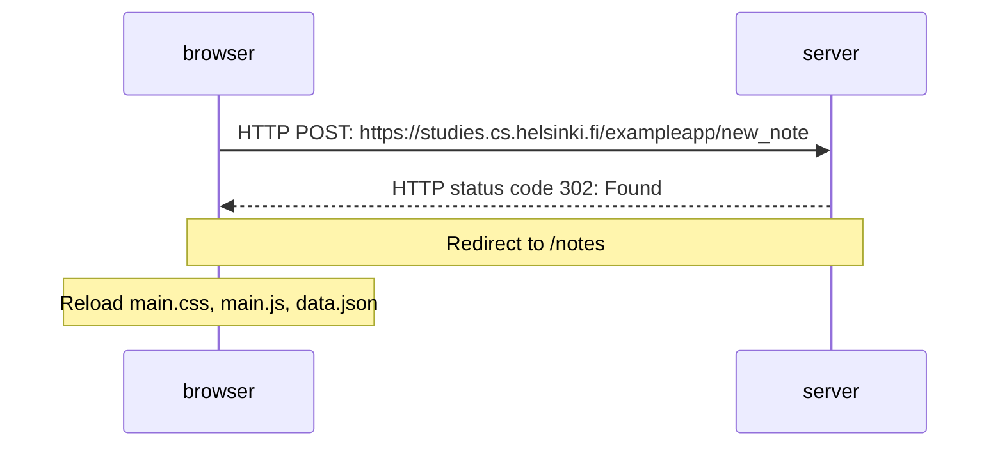
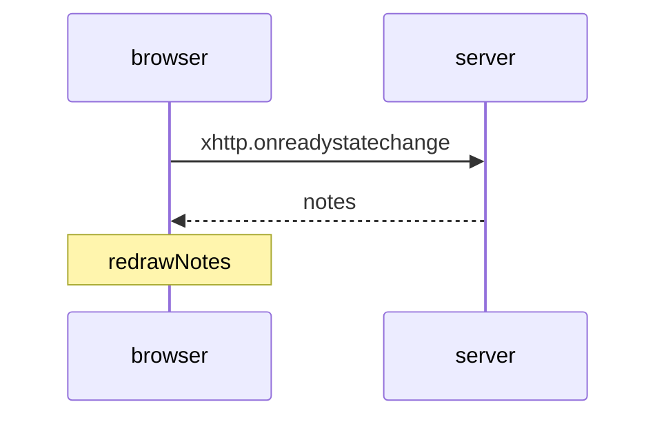

# fullstackopen-p0
## Exercise 4

```mermaid
sequenceDiagram
    browser->>server: HTTP POST: https://studies.cs.helsinki.fi/exampleapp/new_note
    server-->>browser: HTTP status code 302: Found 
    note over browser,server: Redirect to /notes
    note over browser: Reload main.css, main.js, data.json
```
## Exercise 5

```mermaid
sequenceDiagram
    browser->>server: xhttp.onreadystatechange 
    server-->>browser: notes
    note over browser: redrawNotes
```
## Exercise 6

```mermaid
sequenceDiagram
    browser->>server: xhttp.onreadystatechange 
    server-->>browser: notes
    note over browser: redrawNotes
```
